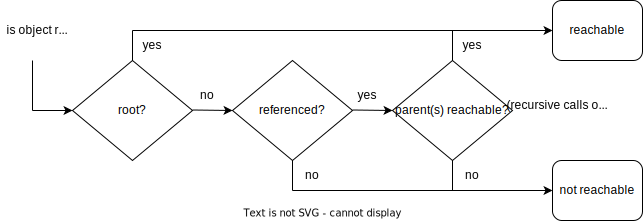

# Garbage Collector

An object will be garbage-collected when it is not reachable or not referenced.

### Special cases

- Circular references when object1 and object2 reference each other. Both are considered unreachable if there are no references to either one.
- Root objects are always reachable and not garbage-collected. If an object has a chain of reference from a root object, it is also not garbage-collected. The definition of root object varies; for e.g. in Android, root objects are:
  - Objects referenced from static fields.
  - Instances of Application class (not a real root but behave like root in most cases).
  - Live threads (after `thread.start()` until its `run()` returns).
- An anonymous/inner thread has an implicit reference to its enclosing object, its parent.
- An inner class object has an implicit reference to its outer class object, its parent.

---

https://www.udemy.com/course/android-multithreading/